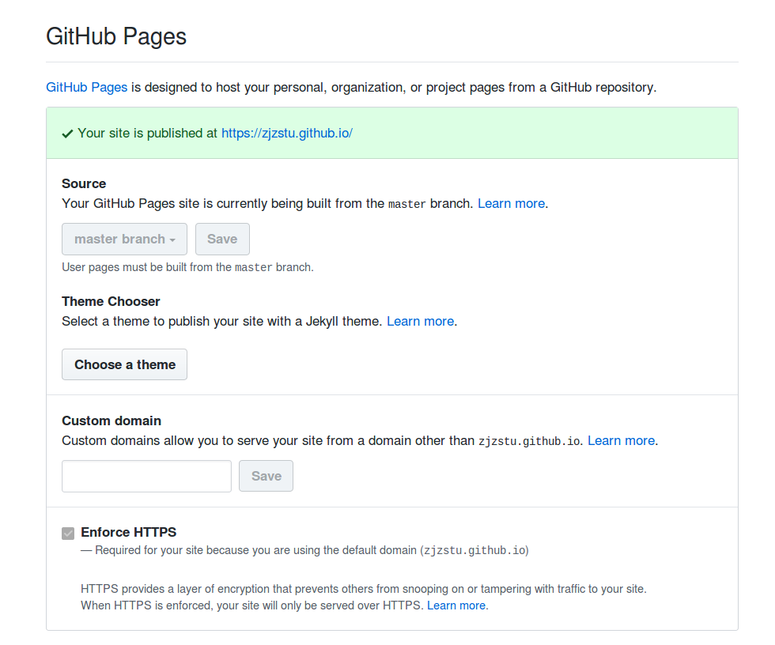
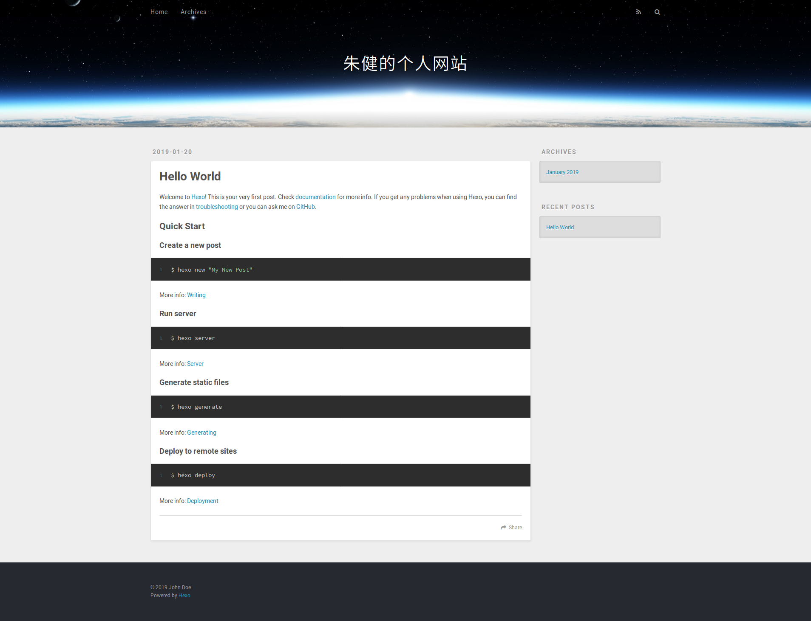

# 远程服务器

参考：[借助GitHub pages搭建静态个人网站并绑定域名](https://blog.csdn.net/weixin_39510813/article/details/80216552)

结合`github`，利用`github pages`生成个人网站，进行在线访问

## 本地配置

参考：[Deployment](https://hexo.io/docs/deployment)

修改`_config.yml`

    # Deployment
    ## Docs: https://hexo.io/docs/deployment.html
    deploy:
        type: 

配置`git`如下

    deploy:
        type: git
        repo: github链接名
        branch: master

**注意 1：`github pages`仅在`master`分支下实现**

**注意 2：可以配置多个`type`，即可以同时部署到多个远程服务器**

    deploy:
        - type: git
          repo:
        - type: heroku
          repo:

## `github`配置

新建一个`github`仓库，命名为

    xxx.github.io

其中`xxx`为你的帐号名

## 部署

安装`git`插件

    $ npm install hexo-deployer-git --save

生成静态文件并部署到远程服务器

    $ hexo clean & hexo generate
    $ hexo deploy

    INFO  Deploying: git
    INFO  Clearing .deploy_git folder...
    INFO  Copying files from public folder...
    INFO  Copying files from extend dirs...
    ...
    ...
    INFO  Deploy done: git

上传的文件即是`public`文件夹内的静态文件，所以也可以通过`git`手动上传

**注意：每次更改文档后都要重新生成静态文件**

## 设置

在`github`个人仓库上，跳到设置页面

找到`github pages`选项

如果你创建的仓库名为`xxx.github.io`(`xxx`为帐号名)，那么`github`自动为你创建了`pages`；如果没有，需要手动设置

这样就可以登录个人网站

    zhujian.github.io

## 自定义

将网站静态文件上传到`master`分支，新建`dev`分支保存源文件

    # 新建分支dev并切换
    git checkout -b dev
    # 上传分支
    git push -u origin dev:dev