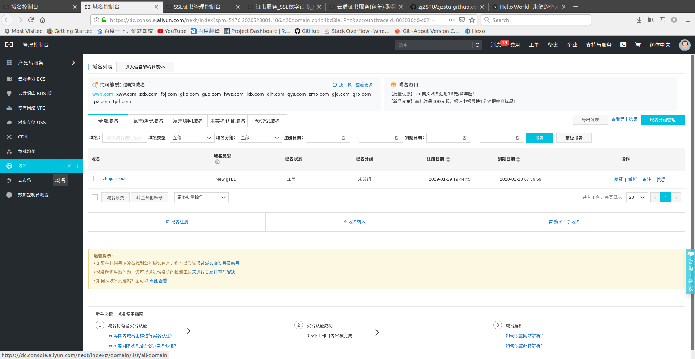
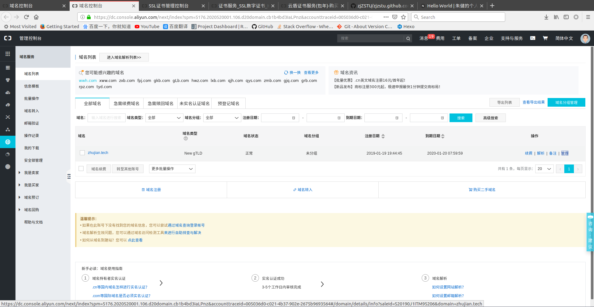
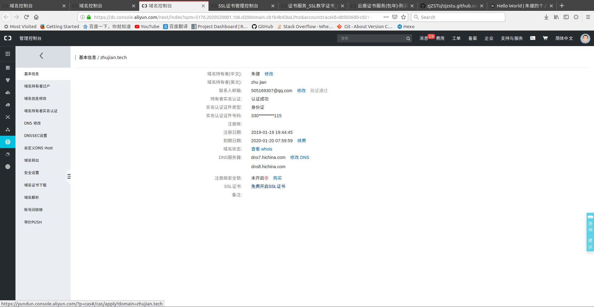
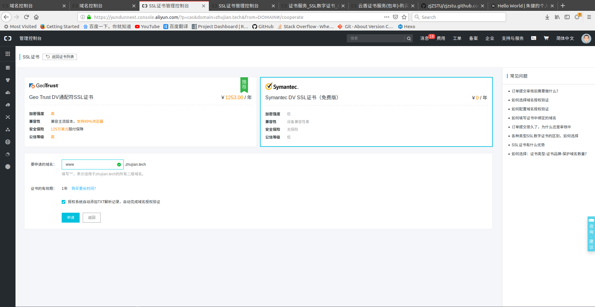
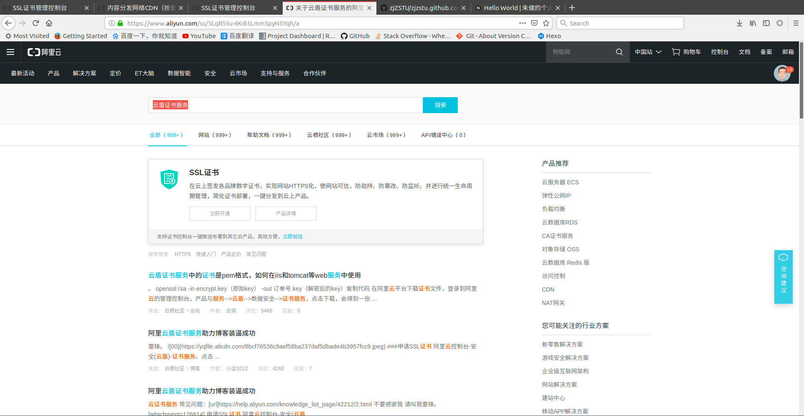
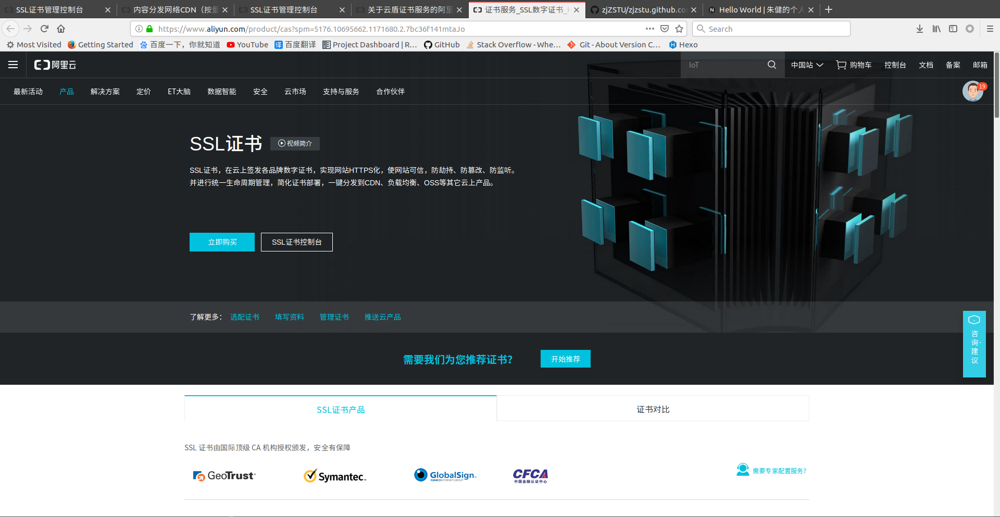
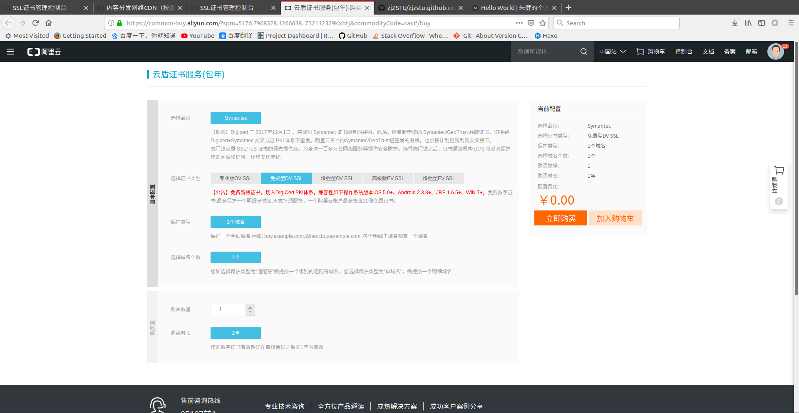

# 域名绑定

自定义域名绑定`github pages`

## 域名注册

我到阿里云上进行域名申请 - [域名注册](https://wanwang.aliyun.com/domain/com/?spm=5176.10695662.1158081.1.598542344N3AF5)

*域名申请完成后可选进行实名认证*

## 域名配置

参考：[GitHub Pages域名绑定2018，别被旧文章误导了](https://blog.csdn.net/FlowerDance17/article/details/80685112)

有两种方法，一是绑定`ip`到域名，二是绑定域名到域名(`CNAME`)

**推荐：`github pages`动态分配`ip`，所以使用`CNAME`方式**

### 绑定`ip`

绑定`ip`到该域名，可通过`ping`命令查看`github pages`的`ip`地址

    $ ping xxx.github.io
    PING xxx.github.io (185.xxx.xxx.153) 56(84) bytes of data.

在个人的域名控制台点击解析选项

选择添加记录

主机记录属性添加域名前缀(如果不加前缀，输入`@`值)，解析线路属性选择**默认**，记录值属性添加`ip`值

### 绑定域名

在`DNS`解析设置中，添加记录，选择记录类型

    CNAME - 将域名指向另外一个域名

其他设置参照绑定`ip`

## github pages配置

回到`github`仓库的设置页面，在`Custom domain`中添加域名即可

*如果要强制`HTTPs`,需要在阿里云的域名管理中开启`SSL`证书*

### `CNAME`文件配置

每次从本地部署到`github`都会重置添加的域名，可以在`sources`文件夹下新建文件`CNAME`，在里面输入绑定的域名，这样每次部署后`github`就会自动绑定到域名

### `SSL`证书申请

参考：[Github pages个人域名添加SSL](https://blog.csdn.net/zaq0123/article/details/79880838)

阿里云提供了免费的SSL证书(支持一个域名)，有两个申请入口

### 入口一

进入阿里云控制台->域名->域名列表

点击已申请域名的**管理**选项，跳转到域名基本信息页面，点击**免费开启SSL证书**选项

跳转到SSL证书申请页面，选择**Symantec DV SSL证书（免费版）**，填充域名(比如`www`)

### 入口二

搜索**云盾证书服务**

点击**立即开通->立即购买**

选择品牌： `Symantec`，选择保护类型：一个域名

在选择证书类型会跳出**免费型DV SLL**

*域名验证类型选择`DNS`，并勾选证书绑定的域名在【阿里云的云解析】产品中*

### `SSL`验证

购买完成后，可以在控制台查看[SSL证书](https://yundunnext.console.aliyun.com/?p=cas&domain=zhujian.tech&from=DOMAIN#/overview/cn-hangzhou)是否已签发，在**云解析DNS**中也会出现一条`TXT`类型记录

在`github`设置中点击`Enforce HTTPs`选项，强制使用`https`登录

