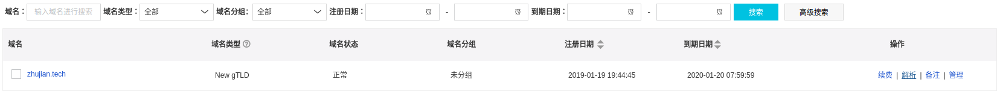

# 域名绑定

自定义域名绑定`github pages`

## 域名注册

我到阿里云上进行域名申请 - [域名注册](https://wanwang.aliyun.com/domain/com/?spm=5176.10695662.1158081.1.598542344N3AF5)

*域名申请完成后可选进行实名认证*

## 域名配置

绑定`ip`到该域名，可通过`ping`命令查看`github pages`的`ip`地址

    $ ping xxx.github.io
    PING xxx.github.io (185.xxx.xxx.153) 56(84) bytes of data.

在个人的域名控制台点击解析选项

选择添加记录

主机记录属性添加域名前缀(也可以不加前缀)，解析线路属性选择**默认**，记录值属性添加`ip`值

然后回到`github`仓库的设置页面，在`Custom domain`中添加域名即可

*如果要强制`HTTPs`,需要在阿里云的域名管理中开启`SSL`证书*
