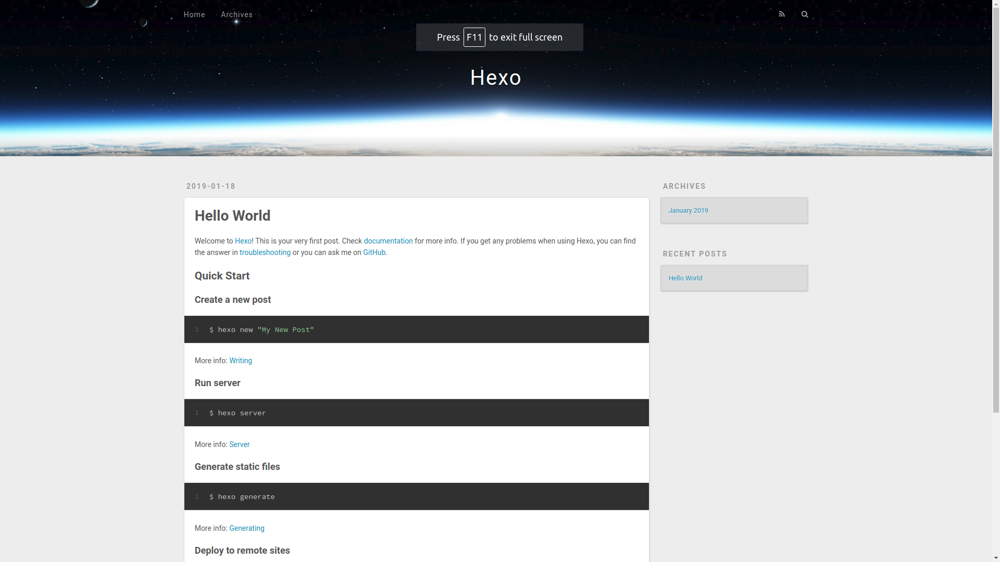

# 新建网站

## 初始化网站

    $ hexo init [folder]

如果没有`folder`就在当前目录下保存网站模板

    $ hexo init
    INFO  Cloning hexo-starter to ~/Documents/hexo-guide/website-sample
    Cloning into '/home/zj/Documents/hexo-guide/website-sample'...
    ...
    INFO  Start blogging with Hexo!

文件结构如下

    .
    ├── _config.yml               // 配置文件
    ├── node_modules              // node模块库
    ├── package.json              // 应用数据，比如已安装插件
    ├── package-lock.json
    ├── scaffolds                 // 脚手架文件夹，生成文章、草稿、页面的模板
    ├── source                    // 源文件
    └── themes                    // 主题

    4 directories, 3 files

## 启动本地服务器

    $ hexo server

在浏览器登录`http://localhost:4000`

### 可选参数

    -i, --ip            Override the default server IP. Bind to all IP address by default.
    -l, --log [format]  Enable logger. Override log format.
    -o, --open          Immediately open the server url in your default web browser.
    -p, --port          Override the default port.
    -s, --static        Only serve static files.

*`Hexo`将监视文件更改并自动更新*