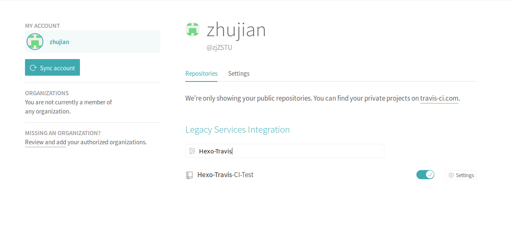
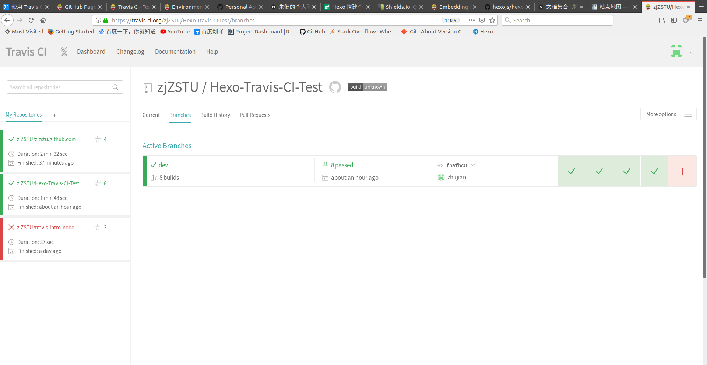
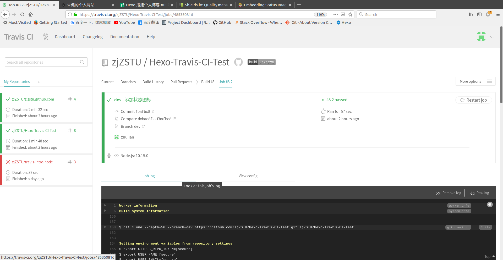
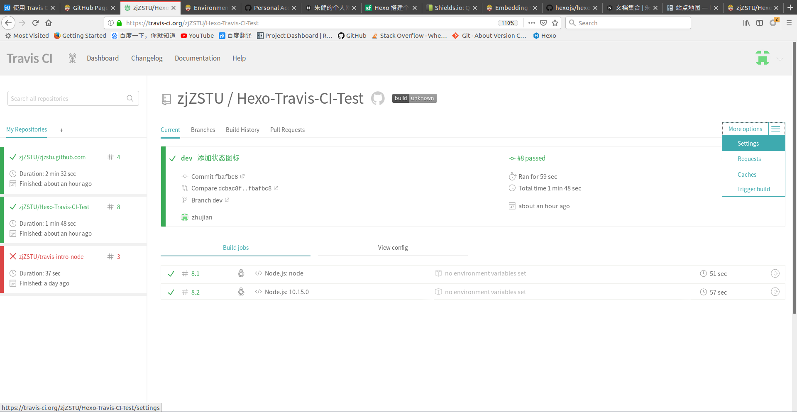
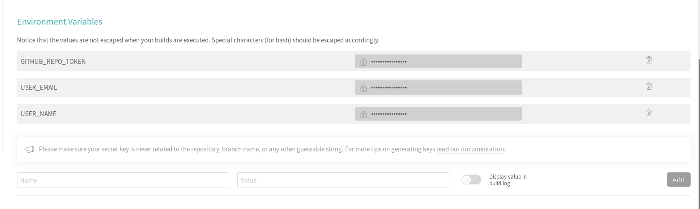
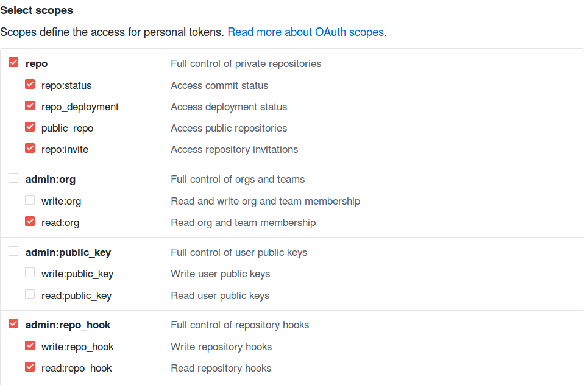
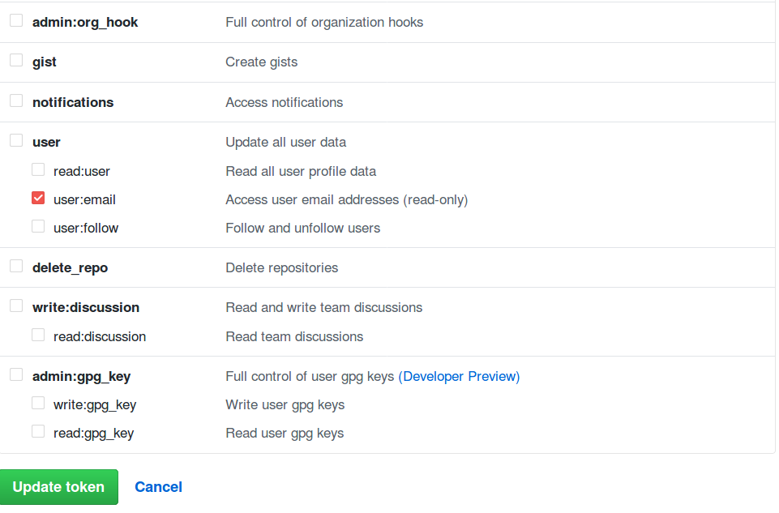
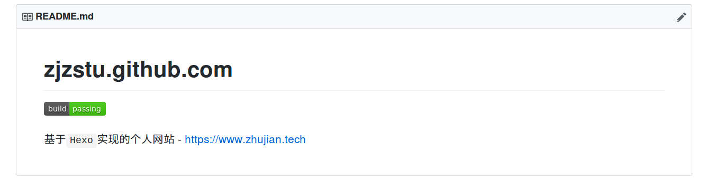
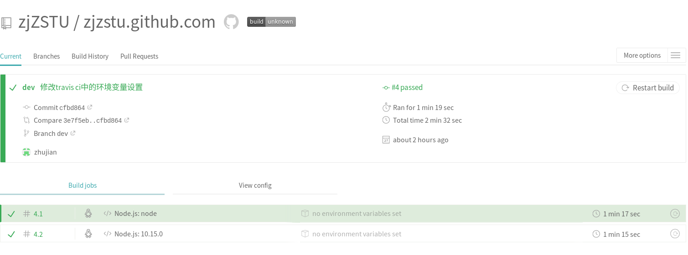
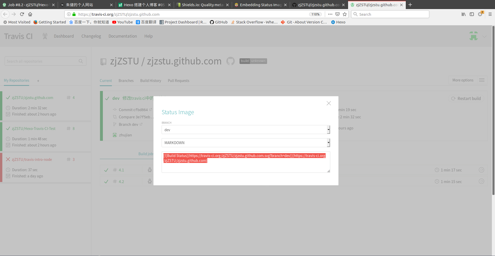

# [Travis CI]持续集成

参考：

[hexo博客－性能优化](https://www.cnblogs.com/jarson-7426/p/5660424.html)

## 什么是持续集成

持续集成指的是每次微小修改都部署到服务器，一方面能够即时展示修改后的效果，另一方面也能将用户体验及时反馈到后台

## 什么是`Travis CI`

配置完成`Hexo`及各项服务后，一个完整的写作流程如下：

1. 新建文章
2. 编写文章
3. 生成静态文件
4. 部署远程服务器
5. 上传文章

利用[Travis CI](https://travis-ci.com/)可以同时实现`3/4/5`步

`Travis CI`是一个深度结合`github`的持续集成服务。每次`github`得到新的提交后，`Travis CI`就会根据配置文件生成虚拟机，配置环境后进行静态文件的生产和部署

整个部署过程非常简单

1. 配置`Travis CI`
2. 生成`.travis.yml`文件

## 配置`Travis CI`

`Travis CI`有两个网址，专门针对开源和私有仓库

1. `https://travis-ci.org/` - 面向开源`github`仓库
2. `https://travis-ci.com/` - 面向私有`github`仓库

利用`github`账户注册后，选择你要集成的仓库即可

## 生成`.travis.yml`文件

需要在工程根目录下放置`.travis.yml`配置文件，当包含该文件的工程上传到`github`时，`Travis CI`自动根据该配置文件中的内容进行编译和部署

我的工程结构如下：

    $ tree -L 2
    .
    ├── blogs
    │   ├── _config.yml
    │   ├── db.json
    │   ├── debug.log
    │   ├── node_modules
    │   ├── package.json
    │   ├── package-lock.json
    │   ├── scaffolds
    │   ├── source
    │   └── themes
    └── README.md

    5 directories, 6 files

文件夹`blogs`内才是`hexo`工程，所以`.travis.yml`文件内容如下：

    themes/next/dist: xenial # Ubuntu 16.04

    language: node_js

    node_js:
    - "node"
    - "10.15.0"

    cache: npm

    branches: 
    only: # 指定分支提交时才会运行travis ci
    - dev

    before_install:
    - npm install -g hexo-cli

    install:
    - cd ./blogs/
    # - git clone https://github.com/zjZSTU/hexo-theme-next.git themes/next
    # - git clone https://github.com/theme-next/theme-next-canvas-nest themes/next/source/lib/canvas-nest
    # - git clone https://github.com/theme-next/theme-next-algolia-instant-search themes/next/source/lib/algolia-instant-search
    - npm install

    # Notice: Replace 'YOUR NAME' and 'YOUR EMAIL'
    before_script:
    - git config --global user.name $USER_NAME
    - git config --global user.email $USER_EMAIL

    script:
    - pwd
    - hexo clean
    - hexo generate
    - hexo algolia # 用于algolia搜集信息

    after_success:
    - sed -i'' "s~https://github.com/zjZSTU/zjzstu.github.com.git~https://${GITHUB_REPO_TOKEN}@github.com/zjZSTU/zjzstu.github.com.git~" _config.yml
    - hexo deploy

    # deploy:
    #   local-dir: ./blogs/public
    #   provider: pages
    #   skip-cleanup: true
    #   github-token: $GITHUB_REPO_TOKEN  # Set in the settings page of your repository, as a secure variable
    #   keep-history: true
    #   target-branch: master
    #   on:
    #     branch: dev

配置文件指定了虚拟机操作系统(`Ubuntu 16.04`)，操作环境(`nodeJS`)以及指定分支（`dev`）提交时才触发

上传后可在个人页面上点击查看相应的日志，如果失败可以及时修改

### 设置环境变量

参考：[Environment Variables](https://docs.travis-ci.com/user/environment-variables/)

有两种方式可以设置环境变量

一是可以在`.travis.yml`中添加环境变量

    env:
        - DB=postgres
        - SH=bash
        - PACKAGE_VERSION="1.0.*"

二是如果有些变量需要保密，可以在网站上进行设置，点击`Settings`按钮

在`Environment Variables`中输入`Name`和`Value`

*选择框`Display value in bulid log`用于是否在构建日志中显示值*

#### 默认环境变量

参考：[Default Environment Variables](https://docs.travis-ci.com/user/environment-variables#default-environment-variables)

### Personal access tokens

之前在本地部署，输入部署命令后在输入用户名和密码，但是在`Travis CI`操作过程中无法输入用户名和密码，可以使用[Personal access tokens](https://github.com/settings/tokens)代替

参考[Creating a personal access token for the command line](https://help.github.com/articles/creating-a-personal-access-token-for-the-command-line/)，登录`Github->Settings->Developer settings->Personal access tokens`，输入token名，然后选择使用范围

参考[Travis CI's use of GitHub API Scopes](https://docs.travis-ci.com/user/github-oauth-scopes/)，开源仓库的`token`设置时应该保证一下权限

* `user:email`
* `read:org`
* `repo_deployment`
* `repo:status`
* `write:repo_hook`

生成后的`token-key`仅显示一次，需要记住（*不然得重新生成一次*）

然后设置到`Tarvis CI`的环境变量中，在配置文件中用`$GITHUB_REPO_TOKEN`替代即可

## 部署

有`3`种方法可以将静态文件上传到指定仓库的指定分支

1. `Travis CI`命令 
2. `git`命令
3. `hexo`部署命令

因为除了要部署到`github`上外，我还集成了一些第三方服务(文章阅读统计、百度自动推送)，所以我选择了第`3`种方式

## `Travis CI`命令 

参考：[GitHub Pages Deployment](https://docs.travis-ci.com/user/deployment/pages/#stq=&stp=0)

`Travis CI`提供了命令`deploy`用于部署到服务器

    deploy:
        local-dir: ./blogs/public
        provider: pages
        skip-cleanup: true
        github-token: $GITHUB_REPO_TOKEN  # Set in the settings page of your repository, as a secure variable
        keep-history: true
        target-branch: master
        on:
            branch: dev

* `local-dir`指定了要推送到`GitHub Pages`的目录，默认是当前目录
* `provider`指定了部署类型是`Github Pages`
* `skip-cleanup`默认为`false`，`Travis CI`将删除生成期间创建的所有文件，设置为`true`能够保证静态文件不被删除
* `github-token`就是`Personal access tokens`
* `keep-history`默认为`false`，是否创建增量提交而不是执行`push force`
* `target-branch`指定了目标分支
* `branch`指定了当前分支

## `git`命令

参考[hexojs/hexo-deployer-git](https://github.com/hexojs/hexo-deployer-git)，其实现方式是生成一个`.deploy_git`文件夹，将静态文件放置其中，然后`force push`到`Github`，所以也可以自定义生成类似操作

## `hexo`配置命令

参考：[使用 Travis CI 部署你的 Hexo 博客](https://zhuanlan.zhihu.com/p/37014376)

`hexo`使用`hexo deploy`执行部署操作，要注意的就是`Personal access tokens`的使用，在`.tarvis.yml`文件中修改`_config.yml`文件内容

    after_success:
    - sed -i'' "s~https://github.com/zjZSTU/zjzstu.github.com.git~https://${GITHUB_REPO_TOKEN}@github.com/zjZSTU/zjzstu.github.com.git~" _config.yml
    - hexo deploy

替换掉原来的仓库名，添加`token`

    # 原来
    https://github.com/zjZSTU/zjzstu.github.com.git
    # 修改后
    https://${GITHUB_REPO_TOKEN}@github.com/zjZSTU/zjzstu.github.com.git

通用格式如下

    sed -i'' "s~https://github.com/<github-name>/<repo-name>.git~https://${GITHUB_REPO_TOKEN}@github.com/<github-name>/<repo-name>.git~" _config.yml

## 状态图标

`Github`很多仓库上都有`Tarvis CI`的状态图标

点击该图标跳转到`Tarvis CI`相应的仓库页面，参考[Embedding Status Images](https://docs.travis-ci.com/user/status-images/)，点击`Tarvis CI`对应页面的状态图标，会弹出一个编辑框，选择`分支/格式`后会生成图像链接

参考[在 README 中查看构建状态](https://segmentfault.com/a/1190000017939431#articleHeader5)，在网站[shields.io](https://shields.io/#/)中还可以自定义图标

