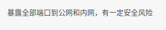

# [腾讯云]部署云服务器

参考：[在腾讯云上部署Hexo博客](https://www.cnblogs.com/QcloudYingJoy/p/6550463.html)

`github`和`coding`的`pages`服务经常会打不开，所以打算自建云服务器进行博客的托管

总的步骤如下：

1. 云服务器注册
2. `nginx`配置
3. `git`裸仓库设置
4. `hexo`部署

本地添加文档后，部署代码到服务器裸仓库，通过钩子将静态文件导入到`nginx`指定的根目录

## 云服务器注册

使用的是[腾讯云服务器](https://cloud.tencent.com/product/cvm)，参考：[云服务器](https://zj-linux-guide.readthedocs.io/zh_CN/latest/cvm.html)

## `nginx`配置

安装`nginx`、测试、托管静态文件，设置`404`页面以及配置`HTTPS`，参考：[nginx](https://zj-network-guide.readthedocs.io/zh_CN/latest/nginx.html)

## `git`裸仓库设置

创建裸仓库，参考：[创建裸仓库](https://zj-git-guide.readthedocs.io/zh_CN/latest/remote/%E5%88%9B%E5%BB%BA%E8%A3%B8%E4%BB%93%E5%BA%93.html)

然后在裸仓库中设置钩子，将工作目录导出到另一个路径下，参考：[工作目录和裸仓库分离](https://zj-git-guide.readthedocs.io/zh_CN/latest/advanced/%E5%B7%A5%E4%BD%9C%E7%9B%AE%E5%BD%95%E5%92%8C%E8%A3%B8%E4%BB%93%E5%BA%93%E5%88%86%E7%A6%BB.html)

## `hexo`部署

修改`hexo`工程配置文件`_config.yml`，在`deploy`小节添加云服务器的`git`裸仓库地址

    # Deployment
    ## Docs: https://hexo.io/docs/deployment.html
    deploy:
      - type: git
        repo: 
          github: xxx,master
          coding: xxx,master
          zhujian: ubuntu@132.232.142.219:/home/ubuntu/git/zhujian.tech.git,master # 裸仓库地址
    ...
    ...

*可以预先设置`SSH`公钥，参考：[密钥连接](https://zj-linux-guide.readthedocs.io/zh_CN/latest/commands/[Ubuntu%2016.04]SSH%E8%BF%9C%E7%A8%8B%E8%BF%9E%E6%8E%A5.html#)*

## OpenSSL出错

某天发现无法加载网页了

```
$ curl https://www.zhujian.tech
curl: (35) OpenSSL SSL_connect: SSL_ERROR_SYSCALL in connection to www.zhujian.tech:443 
```

在云服务器内部能够加载，但是在外部无法加载成功。找了很多内容，发现是腾讯云服务器安全组的关系，之前放开了所有端口，被官方拒绝了所有流量




调整安全组后发现仍旧失效，参考[腾讯云服务器 https 连接不上了](http://neue.v2ex.com/t/573493)，是因为**备案**的原因

我的服务器在腾讯云，所以在上面备案即可，参考[备案流程](https://cloud.tencent.com/document/product/243/18909)