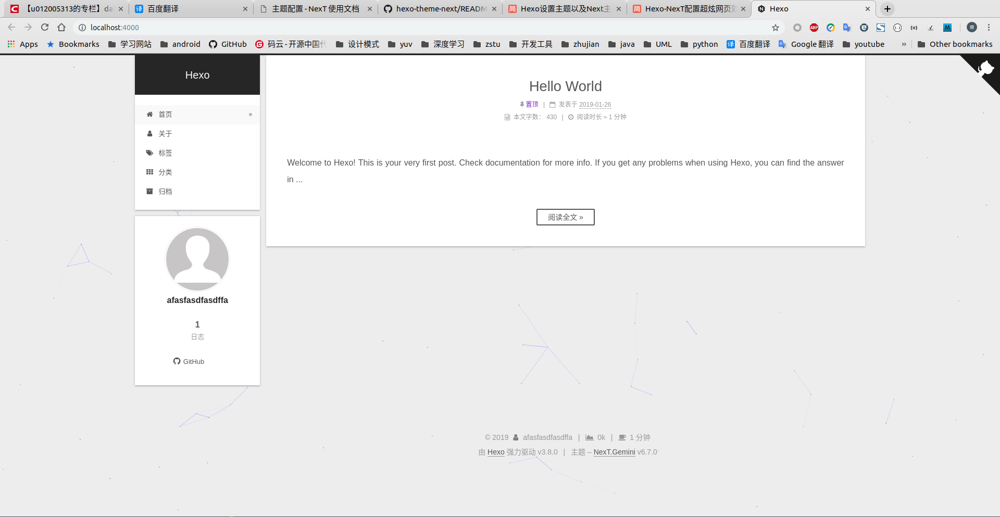

# [NexT]字数统计

参考：[hexo-symbols-count-time](https://github.com/theme-next/hexo-symbols-count-time)

实现文章的字数统计和预计阅读时间

## 安装

    $ npm install hexo-symbols-count-time --save

## 使用

配置工程`_config.yml`

    symbols_count_time:
        symbols: true
        time: true
        total_symbols: true
        total_time: true
    
配置主题`_config.yml`，修改

    # Post wordcount display settings
    # Dependencies: https://github.com/theme-next/hexo-symbols-count-time
    symbols_count_time:
        separated_meta: true
        item_text_post: true
        item_text_total: false
        awl: 4
        wpm: 275

参数`awl`表示平均字节长度；参数`wpm`表示每分钟阅读字数

*如果文章中大多中文，那么设置`awl`为`2`，`wpm`为`300`比较合适*

这样既可以在每篇文章开头和页面底部显示字数和阅读时间

