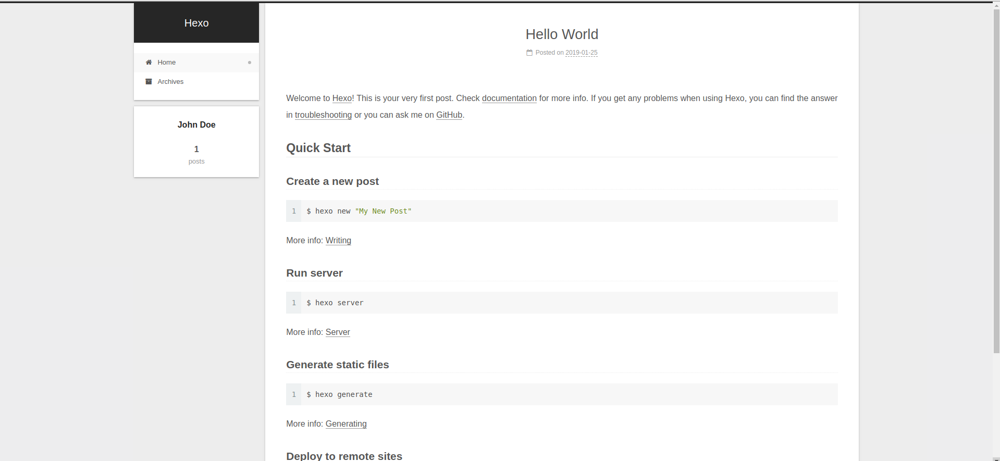
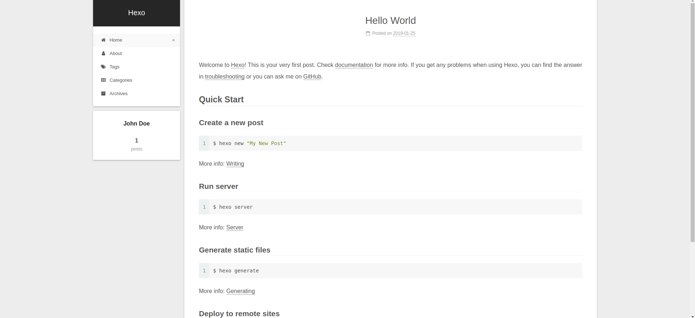

# [NexT]菜单栏

默认开启了首页和存档选项，可修改主题`_config.yml`

    menu:
        home: / || home                     // 主页  
        # about: /about/ || user            // 关于  
        #tags: /tags/ || tags               // 标签
        #categories: /categories/ || th     // 类别   
        archives: /archives/ || archive     // 存档  
        #schedule: /schedule/ || calendar   // 日程表 
        #sitemap: /sitemap.xml || sitemap   // 站点地图
        #commonweal: /404/ || heartbeat     // 404页面  
 

对需要的菜单项取消注释，就可以在页面上看到相应选项，同时还需要对一些选项进行配置

点击`about`选项需要读取`/public/about/`路径下的`index.html`文件，点击`tags`需要读取`/public/tags`下的`index.html`文件，类别选项同理

默认情况下这几个路径下的`index.html`文件为空，需要手动创建

## about

新建页面

    hexo new page about

在`source`文件夹下生成文件夹`about`，其文件结构如下

    .
    ├── index
    └── index.md

    1 directory, 1 file

修改`index.md`文件的`front-matter`，同时可以添加内容

    ---
    title: 关于
    date: 2019-01-23 23:30:47
    tags: about
    ---

    ...
    ...

## 标签&类别

参考：[hexo 下的分类和表签无法显示，怎么解决？](https://www.zhihu.com/question/29017171?sort=created)

与`about`选项操作类似，新建页面文件`tags`和`categories`，同时修改其`.md`文件

    # tags.md
    ---
    title: 标签
    date: 2019-01-23 23:26:43
    type: tags
    ---
    # categories.md
    ---
    title: 类别
    date: 2019-01-23 23:27:04
    type: categories
    ---