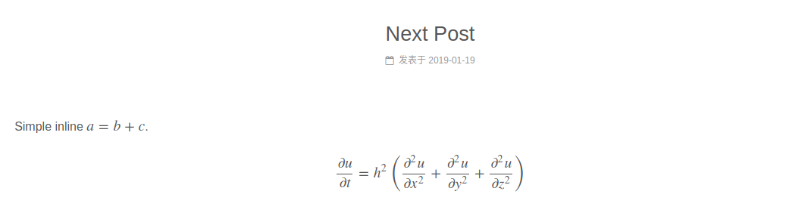

# [NexT]配置MathJax

参考：[数学公式](https://github.com/theme-next/hexo-theme-next/blob/master/docs/zh-CN/MATH.md)

配置`NexT`主题支持数学公式，分为两步

1. 打开`NexT`内部数学公式渲染引擎
2. 打开`hexo`渲染器

## 打开NexT内部数学公式渲染引擎

进入`themes/next/_config.yml`，找到`math`配置

    # MathJax Support
    mathjax:
        enable: false
        per_page: false
        cdn: //cdn.bootcss.com/mathjax/2.7.1/latest.js?config=TeX-AMS-MML_HTMLorMML

    # 或者

    # Math Equations Render Support
    math:
        enable: true

        # Default(true) will load mathjax/katex script on demand
        # That is it only render those page who has `mathjax: true` in Front Matter.
        # If you set it to false, it will load mathjax/katex srcipt EVERY PAGE.
        per_page: true

        engine: mathjax
        #engine: katex

        # hexo-rendering-pandoc (or hexo-renderer-kramed) needed to full MathJax support.
        mathjax:
            # Use 2.7.1 as default, jsdelivr as default CDN, works everywhere even in China
            cdn: //cdn.jsdelivr.net/npm/mathjax@2.7.1/MathJax.js?config=TeX-AMS-MML_HTMLorMML
            # For direct link to MathJax.js with CloudFlare CDN (cdnjs.cloudflare.com)
            #cdn: //cdnjs.cloudflare.com/ajax/libs/mathjax/2.7.1/MathJax.js?config=TeX-MML-AM_CHTML

            # See: https://mhchem.github.io/MathJax-mhchem/
            #mhchem: //cdn.jsdelivr.net/npm/mathjax-mhchem@3
            #mhchem: //cdnjs.cloudflare.com/ajax/libs/mathjax-mhchem/3.3.0

        # hexo-renderer-markdown-it-plus (or hexo-renderer-markdown-it with markdown-it-katex plugin) needed to full Katex support.
        katex:
            # Use 0.7.1 as default, jsdelivr as default CDN, works everywhere even in China
            cdn: //cdn.jsdelivr.net/npm/katex@0.7.1/dist/katex.min.css
            # CDNJS, provided by cloudflare, maybe the best CDN, but not works in China
            #cdn: //cdnjs.cloudflare.com/ajax/libs/KaTeX/0.7.1/katex.min.css

            copy_tex:
            # See: https://github.com/KaTeX/KaTeX/tree/master/contrib/copy-tex
            enable: false
            copy_tex_js: //cdn.jsdelivr.net/npm/katex@0/dist/contrib/copy-tex.min.js
            copy_tex_css: //cdn.jsdelivr.net/npm/katex@0/dist/contrib/copy-tex.min.css

设置属性`enable`为`true`，即打开数学公式渲染

属性`per_page`表示是否自动渲染每一页，如果为`true`就只渲染配置块中包含`mathjax: true`的文章

    ---
    title: Next Post
    date: 2019-01-19 17:36:13
    mathjax: true
    ---

## 打开`hexo`渲染器

进入网站根目录

    npm un hexo-renderer-marked --save
    npm i hexo-renderer-pandoc --save # 或者 hexo-renderer-kramed

数学公式如下

    Simple inline $a = b + c$.

    $$
    \frac{\partial u}{\partial t}
    = h^2 \left( \frac{\partial^2 u}{\partial x^2} +
    \frac{\partial^2 u}{\partial y^2} +
    \frac{\partial^2 u}{\partial z^2}\right)
    $$

启动服务器

    $ hexo clean && hexo server



**问题 1：Error: pandoc exited with code 9: pandoc: Unknown extension: smart**

    $ hexo server
    INFO  Start processing
    FATAL Something's wrong. Maybe you can find the solution here: http://hexo.io/docs/troubleshooting.html
    Error: pandoc exited with code 9: pandoc: Unknown extension: smart

        at ChildProcess.<anonymous> (/home/zj/Documents/zjzstu.github.com/blogs/node_modules/hexo-renderer-pandoc/index.js:84:20)
        at ChildProcess.emit (events.js:182:13)
        at maybeClose (internal/child_process.js:962:16)
        at Socket.stream.socket.on (internal/child_process.js:381:11)
        at Socket.emit (events.js:182:13)
        at Pipe._handle.close (net.js:610:12)

关于新安装的插件pandoc出错，解决方案参考[Hexo配置问题-Pandoc](http://2simple.top/article/Hexo%E9%85%8D%E7%BD%AE%E9%97%AE%E9%A2%98-Pandoc.html)

我安装另一个插件来解决问题

    npm un hexo-renderer-pandoc --save
    npm i hexo-renderer-kramed --save

**问题二：行内公式渲染不完全**

当前我遇到的情况是一行只能渲染一个行内公式，多个公式一起就不成功了

参考[hexo Next主题中支持latex公式(转) ](http://layty.coding.me/2018/09/21/hexo/hexo-Next%E4%B8%BB%E9%A2%98%E4%B8%AD%E6%94%AF%E6%8C%81latex%E5%85%AC%E5%BC%8F/)，渲染插件`hexo-renderer-kramed`针对行内公式渲染有语义冲突，比如对于下划线等符号会转换成`markdown`语法

进入`node_modules/kramed/lib/rules/inline.js`

修改`11`行`escape`变量

```
// escape: /^\\([\\`*{}\[\]()#$+\-.!_>])/,
escape: /^\\([`*\[\]()#$+\-.!_>])/,
```

修改`20`行`em`变量

```
// em: /^\b_((?:__|[\s\S])+?)_\b|^\*((?:\*\*|[\s\S])+?)\*(?!\*)/,
em: /^\*((?:\*\*|[\s\S])+?)\*(?!\*)/,
```

重新生成即可

**注意：如何使用`CI`进行编译生成，需要在编译之前进行修改，比如文件替换**

