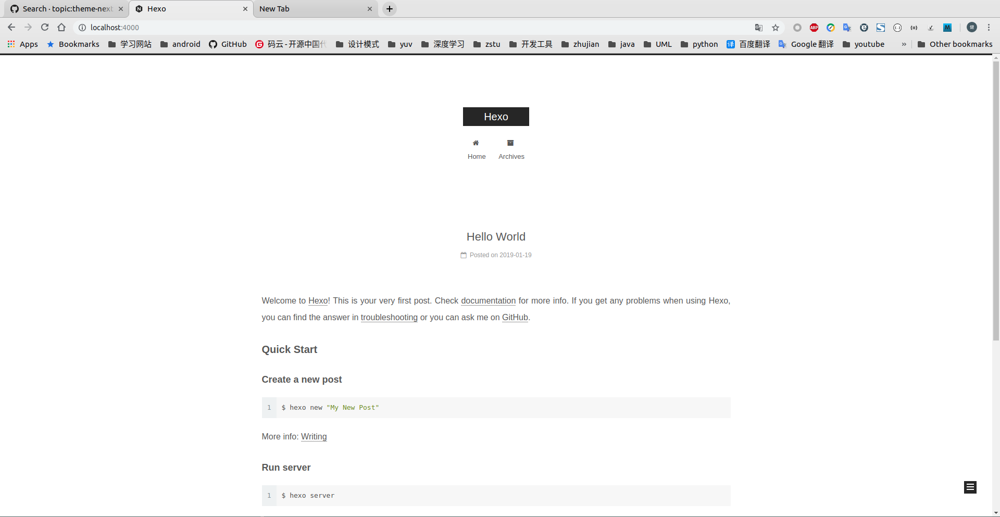

# 设置NexT主题

在[主题列表](https://hexo.io/themes/)中可以找到许多主题，其中`NexT`是一个集成了许多功能的主题，并且不断有新的功能加入其中，所以在网上查询时最好参考最新的文章，同时查询主题`_config.yml`配置

**使用`NexT`版本：`v6.7.0`**

## 参考

`NexT`官方实现网站：[Theme for Hexo](https://theme-next.org/)

个人实现网站：[theme-next](http://theme-next.iissnan.com/)

`NexT github`地址：[theme-next/hexo-theme-next](https://github.com/theme-next/hexo-theme-next/blob/master/docs/zh-CN/README.md)

`NexT`配置博文：

[GitHub+Hexo 搭建个人网站详细教程](https://zhuanlan.zhihu.com/p/26625249)

[Hexo设置主题以及Next主题个性设置](https://www.jianshu.com/p/b20fc983005f)

## 配置

点击进入`github`链接，下载主题包到`themes`目录下，在`_config.yml`文件中修改主题

    theme: landscape

## 安装

安装[theme-next/hexo-theme-next](https://github.com/theme-next/hexo-theme-next)主题

    $ cd hexo
    $ git clone https://github.com/theme-next/hexo-theme-next themes/next

**注意：主题包中也存在一个_config.yml配置文件**

## `git error`

接下来将会在`next`主题包中进行自定义，需要修改相应的内容，但是没有办法加入到版本管理

    $ git add blogs/themes/next/*
    fatal: Pathspec 'blogs/themes/next/bower.json' is in submodule 'blogs/themes

参考[git workflow常用命令](http://www.cnblogs.com/kidsitcn/p/4450466.html)，取消`next`子模块设置

    $ rm blogs/themes/next/.git
    $ git rm --cached blogs/themes/next
    $ git add blogs/themes/next/*

## 语言

设置中文，在工程`_config.yml`文件中修改

    language: zh-CN

`NexT`具体支持哪几种语言可查看

    /themes/next/languages/

## 布局

`NexT`提供了`4`种布局(或称为主题、`scheme`)

    Muse 主题
    Mist 主题
    Pisces 主题
    Gemini 主题

其预览界面可在[hexo-theme-next](https://github.com/theme-next/hexo-theme-next/blob/master/docs/zh-CN/README.md#%E5%8D%B3%E6%97%B6%E9%A2%84%E8%A7%88)中点击相应网站查看

在主题`_config.yml`文件中修改

    # Schemes
    # scheme: Muse
    # scheme: Mist
    # scheme: Pisces
    scheme: Gemini

