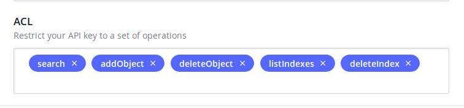

# [Algolia]网站搜索

参考：

[ALGOLIA-SEARCH](https://github.com/theme-next/hexo-theme-next/blob/master/docs/ALGOLIA-SEARCH.md)

[Algolia](http://theme-next.iissnan.com/third-party-services.html#algolia-search)

[hexo-algolia](https://www.npmjs.com/package/hexo-algolia)

[Algolia](https://www.algolia.com/)是一个支持网站搜索功能的在线服务。`NexT`主题也集成了相应的功能，实现步骤如下：

1. 在线注册
2. 本地安装
3. 配置

## 在线注册

首先在`Algolia`官网注册账户，进入控制台后选择`Indices -> Create Index`，输入`Index Name`用于之后的使用

点击`API keys`选项，可以查看你的`Application ID`和`Search-Only API Key`；点击`All API Keys`子选项，选择编辑图标

在`ACL`选项添加`addObject、deleteObject、listIndexes`和`deleteIndex`功能

## 本地安装

在工程目录下安装插件[hexo-algolia](https://github.com/oncletom/hexo-algolia)

    $ npm install --save hexo-algolia

在主题目录下安装插件`algolia-instant-search`

    $ cd themes/next
    $ git clone https://github.com/theme-next/theme-next-algolia-instant-search source/lib/algolia-instant-search

## 配置

设置全局变量

    $ export HEXO_ALGOLIA_INDEXING_KEY=Search-Only API key

将检索数据上传到`Algolia`网站，保存在之前新建的`Index`中

    $ hexo clean
    $ hexo algolia
    INFO  [hexo-algolia] Testing HEXO_ALGOLIA_INDEXING_KEY permissions.
    INFO  Start processing
    INFO  [hexo-algolia] 9 records to index (post, page).
    INFO  [hexo-algolia] Indexing chunk 1 of 1 (9 records)
    INFO  [hexo-algolia] Indexing done.

**注意：更新文章后及时将检索数据上传到`Algolia`网站**

配置工程`_config.yml`

    algolia:
        applicationID: 'applicationID'
        apiKey: 'apiKey'
        indexName: '...'
        chunkSize: 5000

添加在`Algolia`网站生成的`Application ID`、`Search-Only API Key`和`Index Name`

配置主题`_config.yml`

    # Algolia Search
    # See: https://github.com/theme-next/hexo-theme-next/blob/master/docs/ALGOLIA-SEARCH.md
    # Dependencies: https://github.com/theme-next/theme-next-algolia-instant-search
    algolia_search:
        enable: true
        hits:
            per_page: 10
        labels:
            input_placeholder: Search for Posts
            hits_empty: "We didn't find any results for the search: ${query}"
            hits_stats: "${hits} results found in ${time} ms"

设置`enable`为`true`，同时修改提示标签为中文，参考[Hexo+Next集成Algolia搜索](https://juejin.im/post/5af3f9d1518825673e35a6eb)

    labels:
        input_placeholder: 搜索文章
        hits_empty: "我们没有找到任何搜索结果: ${query}"
        hits_stats: "找到约${hits}条结果（用时${time}ms）"
