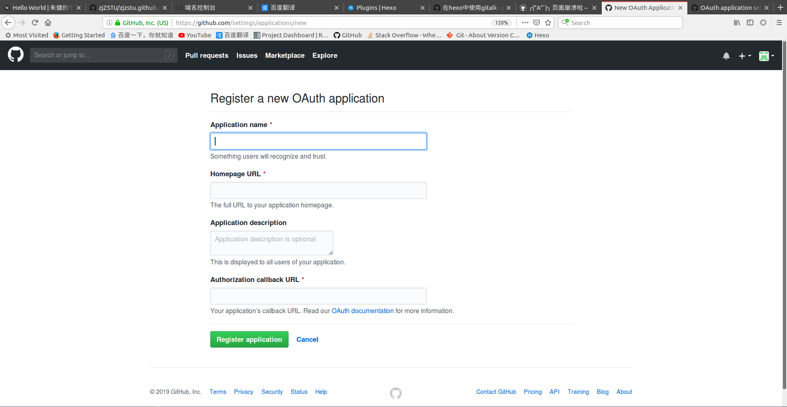

# [Gitalk]评论系统

[gitalk](https://github.com/gitalk/gitalk/blob/master/readme-cn.md)是一个基于`github`开发的评论插件，它将文章评论以`issues`形式保存在`github`仓库中

实现步骤如下：

1. 注册`github`应用
2. `NexT`配置

## 注册`github`应用

进入github注册页面：[Register a new OAuth application ](https://github.com/settings/applications/new)

* Application name：应用名
* Homepage URL：网站地址
* Application description：应用描述
* Authorization callback URL：网站地址

注册成功后会生成`Client ID`和`Client Secret`

## `NexT`配置

修改主题_config.yml

    # Gitalk
    # Demo: https://gitalk.github.io
    # Reference: https://asdfv1929.github.io/2018/01/20/gitalk/, https://liujunzhou.top/2018/8/10/gitalk-error/
    gitalk:
        enable: false
        github_id:  # Github repo owner
        repo:  # Repository name to store issues.
        client_id:  # Github Application Client ID
        client_secret:  # Github Application Client Secret
        admin_user:  # GitHub repo owner and collaborators, only these guys can initialize github issues
        distraction_free_mode: true # Facebook-like distraction free mode

* 设置`enable`为`true`
* `github_id`填入`github`帐号
* `repo`填入`github`仓库名，评论将会以`issues`形式保存在该仓库下
* `client_id`填入注册生成的值
* `client_secret`填入注册生成的值
* `admin_user`填入`github`帐号，用于初始化评论账户

## `Error: Not Found`

问题描述：在文章底部评论框中出现错误信息

    Error: Not Found

解决：和`repo`属性有关，换一个新的仓库，比如新建仓库`guestbook`

## 隐藏评论框

设置`gitalk`评论系统后，将会在每篇文章末尾添加评论框，而对于标签页/类别页等不需要评论的文章，可在`front-matter`设置属性进行隐藏

    comments: false

