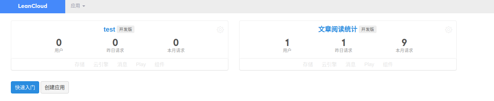
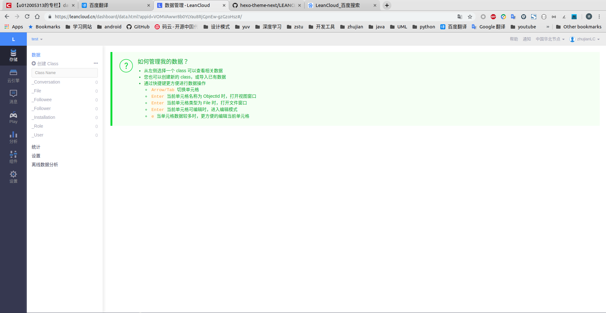
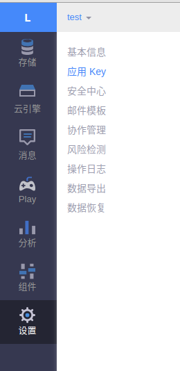
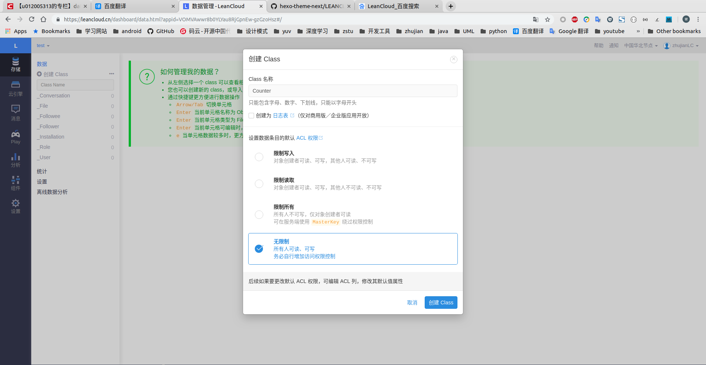
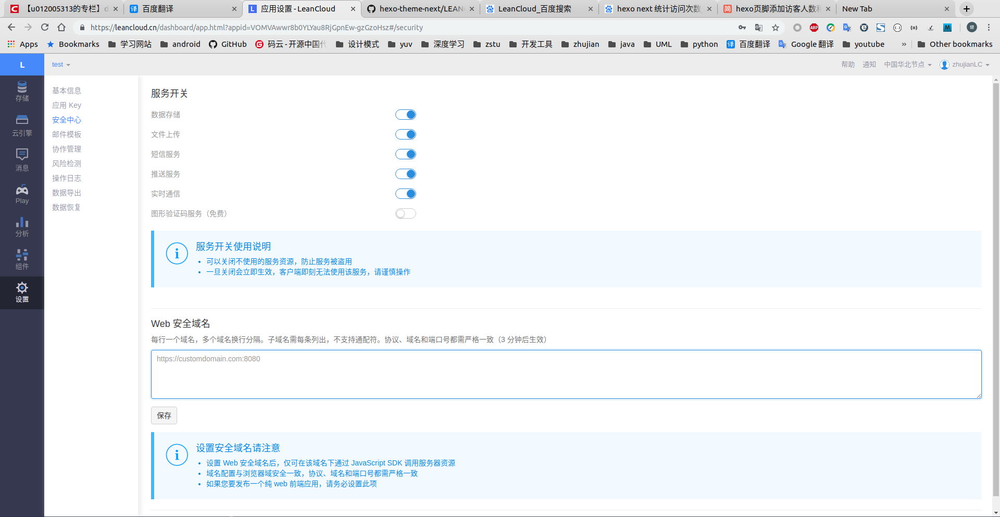
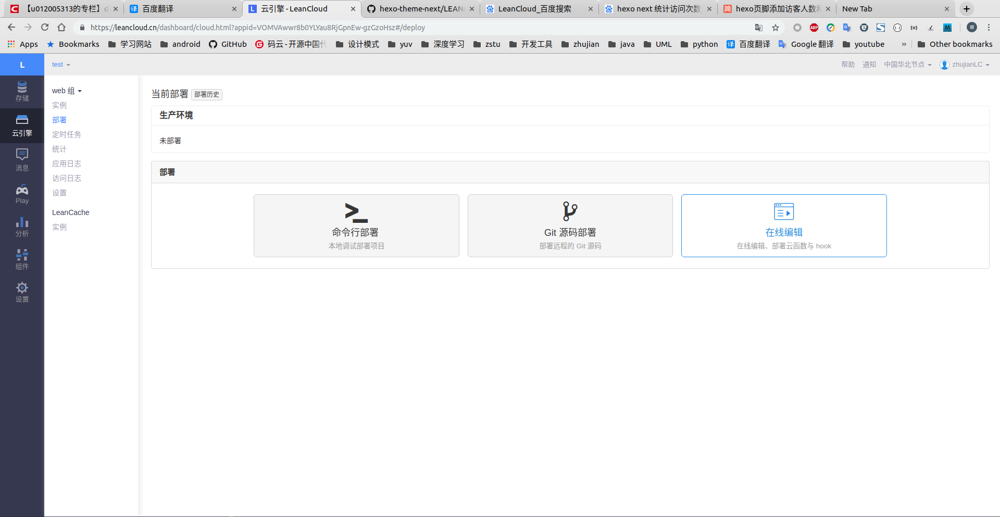
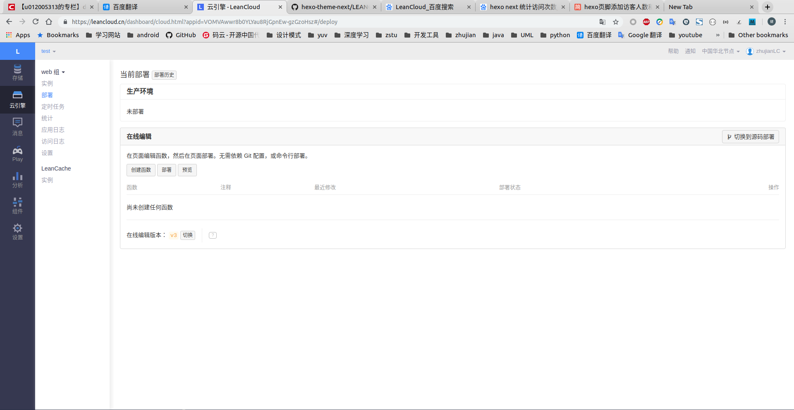
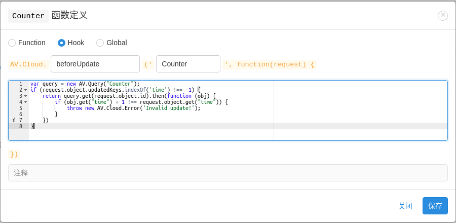
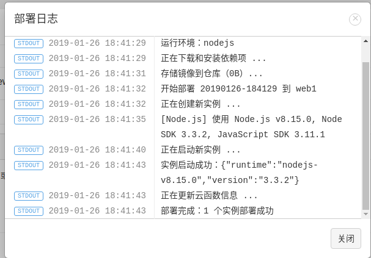
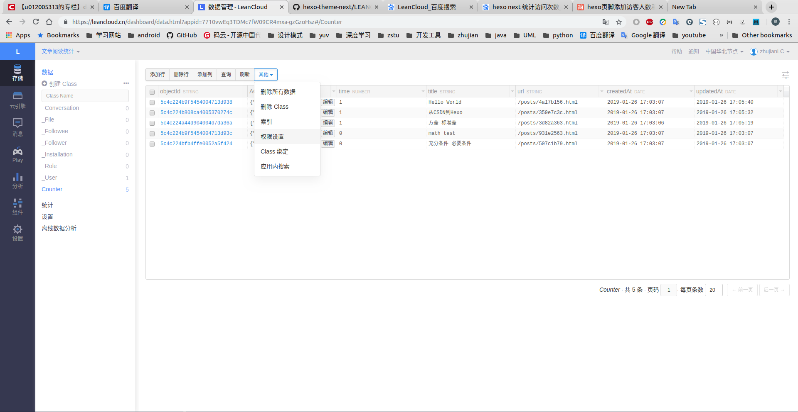

# [LeanCloud]文章阅读次数

[LeanCloud](https://leancloud.cn/)是一个提供后台服务的云服务，`NexT`主题集成了通过`LeanCloud`统计文章阅读次数功能，同时为防止随意篡改阅读次数，还需要进行安全设置

参考：

[Leancloud访客统计插件重大安全漏洞修复指南](https://leaferx.online/2018/02/11/lc-security/)

[LEANCLOUD-COUNTER-SECURITY](https://github.com/theme-next/hexo-theme-next/blob/master/docs/zh-CN/LEANCLOUD-COUNTER-SECURITY.md)

## 基本配置

### `LeanCloud`

注册`LeanCloud`后，进入控制台，点击`创建应用`，自定义`新应用名称后`，点击创建

点击创建的应用，进入数据管理页面

在左侧菜单栏`设置`->`应用 Key`可查看`App ID`和`App Key`

在左侧菜单栏`存储`选项，点击`创建Class`按钮，输入`Class名称`为`Counter`(默认设置)，设置`ACL权限`为无限制

### 本地

配置主题`_config.yml`，加入`LeanCloud`生成的`app_id`和`app_key`

    # Show number of visitors to each article.
    # You can visit https://leancloud.cn get AppID and AppKey.
    leancloud_visitors:
        enable: false
        app_id: #<app_id>
        app_key: #<app_key>

## 安全设置

### 确保域名调用安全

点击`设置->安全中心`，在`Web`安全域名填入网站域名

### 保证访客数量不被随意篡改

点击`云引擎->部署->在线编辑`

点击`创建函数`，选择`Hook`类型，弹出类选择框，选择`beforeUpdate`和`Counter`，并填入实现函数

    var query = new AV.Query("Counter");
    if (request.object.updatedKeys.indexOf('time') !== -1) {
        return query.get(request.object.id).then(function (obj) {
            if (obj.get("time") + 1 !== request.object.get("time")) {
                throw new AV.Cloud.Error('Invalid update!');
            }
        })
    }

保存该函数，然后点击`部署`按钮，等待`部署完成：1 个实例部署成功`

### 安全访问

进入工程路径下，安装

    npm install hexo-leancloud-counter-security --save

创建用户

    hexo lc-counter register <<username>> <<password>>
    # 或
    hexo lc-counter r <<username>> <<password>>

配置工程`_config.yml`，填入

    deploy:
        ...
        - type: leancloud_counter_security_sync

    leancloud_counter_security:
        enable_sync: true
        app_id: <<your app id>>
        app_key: <<your app key>
        username: 
        password:

`app_id`和`app_key`由之前`LeanCloud`生成，`username`和`password`输入刚才创建的本地用户

配置主题`_config.yml`，打开`security`开关

    leancloud_visitors:
        ...
        # Dependencies: https://github.com/theme-next/hexo-leancloud-counter-security
        # If you don't care about security in leancloud counter and just want to use it directly
        # (without hexo-leancloud-counter-security plugin), set `security` to `false`.
        security: true
        ...

在LeanCloud控制台`存储->_User`，查看是否有新的用户

选择`Counter->其他->权限设置`

选择`add_fields->指定用户`，填入刚才创建的用户名并添加

选择`create->指定用户`，填入刚才创建的用户名并添加

选择`delete->指定用户`，保留其他设置

