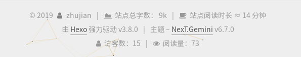
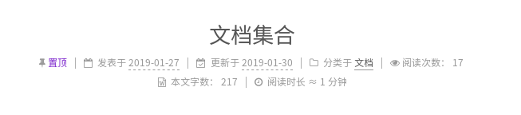

# [不蒜子]文章阅读次数

之前使用`LeanCloud`实现文章阅读次数，发现请求速度不理想，使用[不蒜子](http://busuanzi.ibruce.info/)能够很好的实现文章阅读次数统计功能

## 取消`LeanCloud`设置

如果之前设置了`LeanCloud`，需要测试相应的文件

1. 修改主题`_config.yml`，设置

        leancloud_visitors:
            enable: false

2. 修改工程`_config.yml`，撤销`leancloud_counter_security`配置块，同时撤销`deploy`中`leancloud_counter_security_sync`

3. 卸载`LeanCloud`安全插件

        npm install hexo-leancloud-counter-security --save

## 设置不蒜子统计

参考：[不蒜子](http://ibruce.info/2015/04/04/busuanzi/)

修改主题文件

    themes/你的主题/layout/_macro/post.swig

找到`{# LeanCloud PageView #}`，在其下面加入

    
        |
        
        <i class="fa fa-eye"></i>
        
        阅读量: 次
    

用于统计`PV`次数

## 使用主题默认设置

原来NexT主题已经集成了不蒜子的访客人数和文章阅读统计

修改主题_config.yml

    # Show Views/Visitors of the website/page with busuanzi.
    # Get more information on http://ibruce.info/2015/04/04/busuanzi
    busuanzi_count:
        enable: true
        total_visitors: true
        total_visitors_icon: user
        total_views: true
        total_views_icon: eye
        post_views: true
        post_views_icon: eye

设置`enable`为`true`即可

在底部可以看见访客人数和文章阅读次数

不在首页显示每篇文章的阅读次数，点击全文阅读即显示阅读次数

