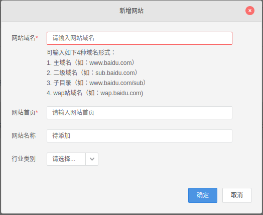

# [百度统计]网站访问信息

通过[百度统计](https://tongji.baidu.com/web/27249108/welcome/login)查询网站访问信息

## 百度统计设置

登录后进入侧边栏`账户管理 -> 网站列表`，点击右侧`新增网站`按钮



添加`网站域名/网站首页`信息后，点击`确定`按钮，百度统计会提供一段`JS`脚本用于嵌入

```
<script>
var _hmt = _hmt || [];
(function() {
  var hm = document.createElement("script");
  hm.src = "https://hm.baidu.com/hm.js?百度统计生成的键";
  var s = document.getElementsByTagName("script")[0]; 
  s.parentNode.insertBefore(hm, s);
})();
</script>
```

## next配置

进入`themes/next/_config.yml`，找到关键字

```
# Baidu Analytics ID
baidu_analytics: 输入百度统计生成的键
```

`next`主题已经集成了百度统计设置功能，相关文件在`next/layout/_third_party/analytics/baidu-analytics.swig`

```

  <script>
    var _hmt = _hmt || [];
    (function() {
      var hm = document.createElement("script");
      hm.src = "https://hm.baidu.com/hm.js?{{ theme.baidu_analytics }}";
      var s = document.getElementsByTagName("script")[0];
      s.parentNode.insertBefore(hm, s);
    })();
  </script>

```

设置完成后编译、部署，大约20分钟后就能查看网站分析数据了